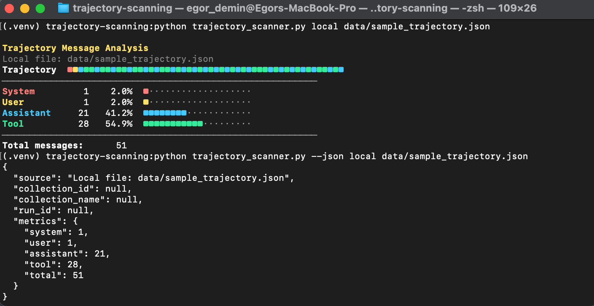

# Trace Monitoring

`trace-monitoring` is a small CLI for analyzing message trajectories from local JSON files or remote Docent runs. It counts how many messages belong to each role (`system`, `user`, `assistant`, `tool`) and presents the result either as a human-readable terminal report or as structured JSON.



## Features

- Analyzes local trajectory payloads from JSON files
- Fetches and analyzes remote trajectories from Docent
- Supports interactive selection of collections and runs
- Can analyze a single run, all runs in one collection, or all runs across all collections
- Computes batch averages for multi-run analysis
- Exports batch analysis data to `output/*.json`

## Requirements

- Python 3.11+
- Optional for remote mode: `docent-python`
- Optional for loading `.env`: `python-dotenv`
- Optional for running tests: `pytest`
- Optional for code coverage: `coverage`

## Setup

1. Create an account at docent.transluce.org and sign in
2. Obtain your API key from the Docent settings page
3. Create and activate a virtual environment, then install the dependencies you need:

```bash
python3 -m venv .venv
source .venv/bin/activate
pip install docent-python python-dotenv pytest coverage
```

If you want to use remote Docent access, set your API key:

```bash
cp example.env .env
```

Then update `.env`:

```env
DOCENT_API_KEY=YOUR_API_KEY
```

## CLI Overview

The main entrypoint is:

```bash
python3 trajectory_scanner.py
```

Global flags:

- `--json` prints machine-readable JSON
- `--no-color` disables ANSI color output

Subcommands:

- `local` analyzes a local JSON file
- `remote` analyzes Docent trajectories
- `collections` lists available Docent collections
- `runs` lists run IDs for one Docent collection

## Local Analysis

Analyze the bundled sample trajectory:

```bash
python3 trajectory_scanner.py local data/sample_trajectory.json
```

JSON output:

```bash
python3 trajectory_scanner.py --json local data/sample_trajectory.json
```

Current sample output:

```json
{
  "source": "Local file: /.../data/sample_trajectory.json",
  "collection_id": null,
  "collection_name": null,
  "run_id": null,
  "metrics": {
    "system": 1,
    "user": 1,
    "assistant": 21,
    "tool": 28,
    "total": 51
  }
}
```

## Remote Docent Analysis

### Interactive mode

Launch the selector and choose a collection and run interactively:

```bash
python3 trajectory_scanner.py remote
```

### Analyze one specific run

```bash
python3 trajectory_scanner.py remote \
  --collection-id COLLECTION_ID \
  --run-id RUN_ID
```

### Analyze all runs in one collection

```bash
python3 trajectory_scanner.py remote \
  --collection-id COLLECTION_ID \
  --all-runs
```

### Analyze all runs across all collections

```bash
python3 trajectory_scanner.py remote --all-collections
```

## Listing Collections and Runs

List collections:

```bash
python3 trajectory_scanner.py collections
```

List collections as JSON:

```bash
python3 trajectory_scanner.py --json collections
```

List run IDs for one collection:

```bash
python3 trajectory_scanner.py runs --collection-id COLLECTION_ID
```

List run IDs as JSON:

```bash
python3 trajectory_scanner.py --json runs --collection-id COLLECTION_ID
```

## Output Modes

### Human-readable report

For single trajectories, the CLI prints a terminal report with:

- an ordered trajectory strip made of colored squares
- message counts by role
- percentage share of each role
- a simple bar visualization

For batch analysis, it also prints:

- average metrics across runs
- per-collection averages
- a cross-collection comparison table

### JSON output

`--json` returns structured output suitable for scripts or downstream analysis.

Single-run analysis returns:

- `source`
- `collection_id`
- `collection_name`
- `run_id`
- `metrics`

Batch analysis returns aggregate data plus exported file paths:

- `scope`
- `run_count`
- `overall_average`
- `collections`
- `export_files`

## Batch Export Files and Caching

When you analyze more than one remote trajectory, the tool writes JSON exports to `output/`.

For `--all-runs` in a single collection:

- `output/all_runs_<collection_id>_metrics.json`

For `--all-collections`:

- `output/all_collections_collection_run_mappings.json`
- `output/all_collections_runs_data.json`

These exports contain per-run metrics and aggregate summaries for downstream processing.

### Caching

Batch analysis results are cached to the `output/` directory. On subsequent runs with the same collection and mode (`--all-runs` or `--all-collections`), the tool will load cached metrics instead of re-fetching from Docent. This significantly speeds up repeated analysis of the same collections.

Cache validation:
- For `all_runs`: Verifies the collection_id matches
- For `all_collections`: Checks both mapping and runs files exist with correct scope

If cache files are missing or invalid, the tool automatically fetches fresh data from Docent.

## Supported Input Shapes

The local parser accepts trajectory payloads that contain messages in one of these forms:

- top-level `messages`
- nested `agent_run.messages`
- transcript-style `transcripts[*].messages`
- sequences containing one or more of the formats above

Each message is normalized and counted by `role`.

## Code Architecture

### Core Components

- **Message Extraction**: Unified message extraction pipeline handles multiple trajectory formats (direct JSON, Docent SDK objects, transcript collections)
- **Metrics Computation**: Stateful `Metrics` and `AverageMetrics` dataclasses for precise message role counting and batch averaging
- **Client Management**: Centralized Docent client building with automatic `.env` loading and API key resolution
- **Batch Processing**: Supports three remote analysis modes:
  - Single run (interactive or direct)
  - All runs in one collection (with caching)
  - All collections and runs (with caching)
- **Export & Aggregation**: Automatic JSON export with per-collection grouping, run-level metrics, and cross-collection comparison tables

## Development

Run tests:

```bash
pytest -q
```

Check code coverage:

```bash
coverage run -m pytest && coverage report -m
```

Current status in this repository:

- `49 tests`
- `100% code coverage`

```
Name                               Stmts   Miss  Cover   Missing
----------------------------------------------------------------
tests/conftest.py                      5      0   100%
tests/test_trajectory_scanner.py     551      0   100%
trajectory_scanner.py                641      0   100%
----------------------------------------------------------------
TOTAL                               1197      0   100%
```


## Project Layout

```text
trajectory_scanner.py              Main CLI implementation
tests/test_trajectory_scanner.py   Test suite
data/sample_trajectory.json        Sample local trajectory
example.env                        Example environment file
output/                            Generated batch exports
```
